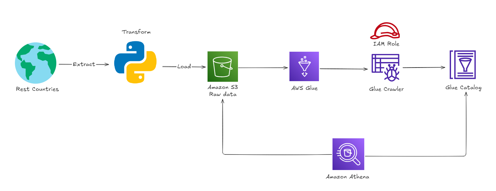

# Query Lakehouse on AWS
This project consists of a Python script that extracts data from the Rest Countries API, uploads it to AWS S3 (serving as a LakeHouse), utilizes AWS Glue to catalog the data, and finally uses Athena to perform queries on the S3 data via the Glue catalog.

## Project Architecture

## Features

- Connection to the **Rest Countries** API to fetch data about countries.
- Data processing and transformation into a structured format using **Pandas**.
- Generation of a CSV file with the processed data.
- Creation of a bucket on **Amazon S3**.
- Upload of the CSV file to the **Amazon S3** bucket.
- Data cataloging with **AWS Glue**.
- SQL querying of the cataloged data using **AWS Athena**.

---

## Technologies Used

- **Python**: Language used to implement the project script.
- **AWS S3**: Storage service that serves as the foundation for the LakeHouse.
- **AWS Glue**: Framework for cataloging and orchestrating ETL tasks.
- **AWS Athena**: Tool for SQL queries on data cataloged in Glue.

---

## How to Run the Project

You need an AWS account and must configure it using `aws configure` or run the code in the AWS Shell.

After that, create a role in IAM to be used by the Glue crawler with S3 read permissions, and update the ARN in the `.env` file.

With this setup, the code performs all steps, including:
- Making a request to the Rest Countries API.
- Creating an S3 bucket.
- Uploading the JSON file to the bucket.
- Cataloging the data with AWS Glue.
- Querying the catalog with AWS Athena.

Code output:

S3 screen after bucket creation:

Glue catalog after crawler execution:

Athena query using the Glue catalog:

