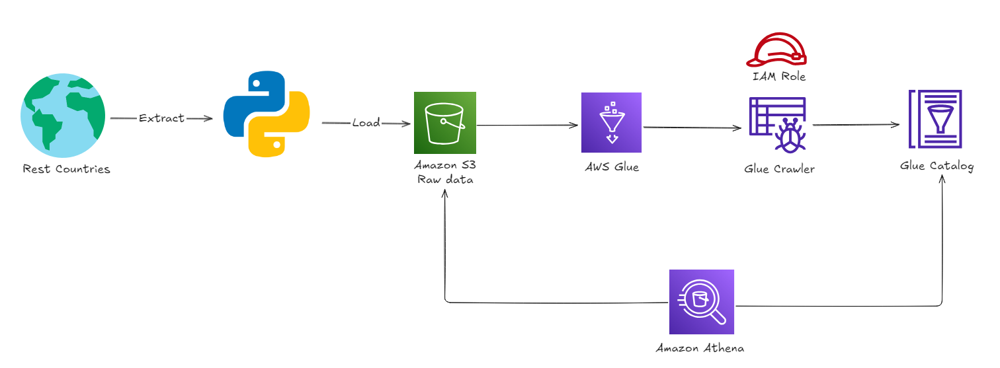
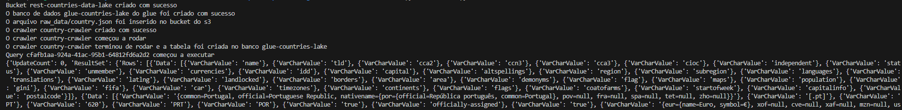
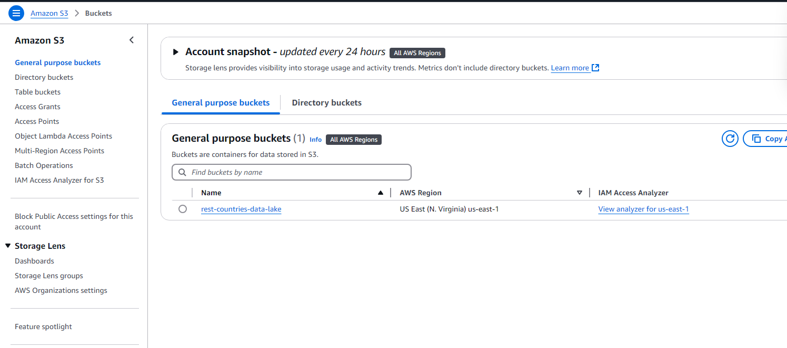
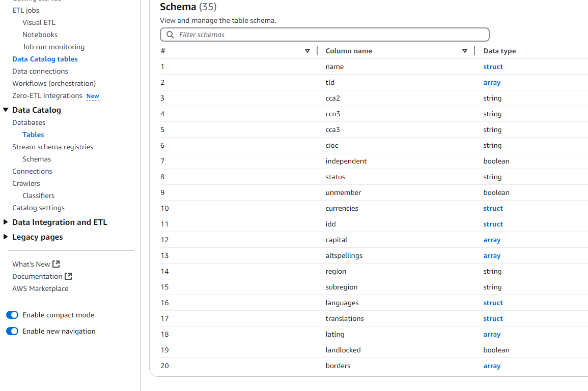
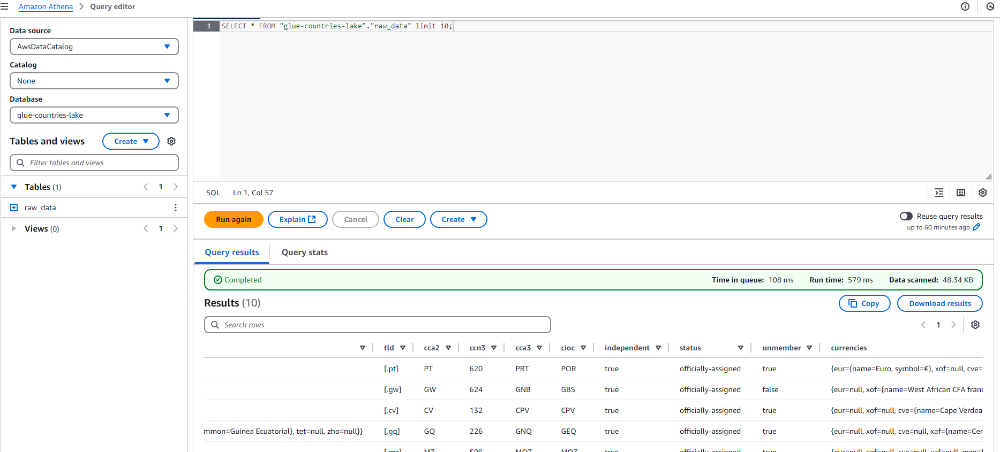

# Query lakehouse na AWS
Este projeto consiste em um script Python que extrai dados de paises da API Rest Countries, joga no AWS S3 que serve como LakeHouse e utiliza o AWS Glue para catalogar os dados e por fim utiliza o Athena para fazer consultas no S3 pelo catálogo do Glue.

## Arquitetura do projeto

## Funcionalidades

- Conexão com a API **Rest Countries** para obtenção de dados sobre países.
- Tratamento e transformação dos dados em um formato estruturado com **Pandas**.
- Geração de um arquivo CSV com os dados tratados.
- Criação de um bucket no **Amazon S3**.
- Upload do arquivo CSV para o bucket no **Amazon S3**.
- Catalogação dos dados no **AWS Glue**.
- Consulta SQL nos dados catalogados usando o **AWS Athena**.

---

## Tecnologias Utilizadas

- **Python**: Linguagem utilizada para a realização do script do projeto.
- **AWS S3**: Serviço de armazenamento que serve como base para o Lakehouse.
- **AWS Glue**: Framework para catalogação e orquestração de tarefas ETL.
- **AWS Athena**: Ferramenta para consultas SQL nos dados catalogados no Glue.

---

## Como Rodar o Projeto

É necessário ter uma conta na AWS e realizar as configurações com o aws configure ou rodar o código no shell da AWS.

Após isso é necessário criar uma role no IAM que será utilizado pelo crawler do glue com as permissões de leitura do S3, e mudar o ARN no .env. 

Com isso o código já faz tudo, onde faz a requisição para a API do rest countries, cria um bucket S3, sobe o arquivo json para o bucket, cataloga os dados com o AWS Glue e realiza consultas no catálogo usando o AWS Athena.

Output do código:

Tela do S3 após a criação do bucket:

Catalogo do Glue após a execução do crawler:

Consulta no Athena pelo catalogo do Glue:

